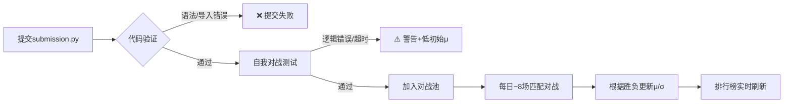

# ConnectX 竞赛项目需求规格说明书

> **文档编号**：CX-REQ-2026-001  
> **版本号**：v1.2  
> **生效日期**：2026年5月  
> **保密级别**：公开  

---

## 📋 文档修订记录

| 版本 | 日期 | 修订人 | 修订内容 | 审核状态 |
|------|------|--------|----------|----------|
| v1.0 | 2026-05-01 | AI Assistant | 初稿创建 | ✅ 已审核 |
| v1.1 | 2026-05-15 | AI Assistant | 补充评测细节与约束条件 | ✅ 已审核 |
| v1.2 | 2026-05-21 | AI Assistant | 完善开发指南与测试用例 | ✅ 已审核 |

---

## 1. 引言

### 1.1 编写目的
本文档旨在明确 **Kaggle ConnectX 竞赛项目** 的技术需求、功能规格、约束条件及验收标准，为参赛者开发智能代理（Agent）提供完整、准确、可执行的参考依据。

### 1.2 项目背景
ConnectX 是 Kaggle 推出的**模拟类竞赛（Simulation Competition）**试点项目，核心任务是通过强化学习/博弈算法开发能够自主决策的"连子棋"游戏AI。本项目区别于传统监督学习竞赛，强调：
- 🔄 动态对抗环境下的决策能力
- ⚡ 实时响应与资源约束下的算法效率
- 🧠 策略泛化与对手自适应能力

### 1.3 目标读者
| 角色 | 使用场景 |
|------|----------|
| 参赛者/开发者 | 理解任务要求，设计并实现Agent |
| 算法工程师 | 评估技术方案可行性，优化性能 |
| 竞赛组织者 | 验证提交合规性，维护评测系统 |
| 技术评审 | 审核方案设计与实现质量 |

### 1.4 术语定义
| 术语 | 定义 |
|------|------|
| **Agent** | 参赛者提交的智能决策程序，每回合输出落子列索引 |
| **Observation** | 游戏环境反馈的当前状态信息（棋盘、标识、剩余时间等） |
| **Configuration** | 游戏规则参数（棋盘尺寸、连珠数等） |
| **μ (mu)** | Elo评分系统中的技能水平估计值，用于排行榜排序 |
| **σ (sigma)** | 技能评估的不确定性度量，随对战次数增加而收敛 |
| **inarow** | 获胜所需的最小连续同色棋子数量（默认=4） |

---

## 2. 项目概述

### 2.1 核心目标
开发一个Python函数 `agent(observation, configuration)`，使其在"连子棋"博弈中：
```
✅ 优先争取胜利（形成inarow连珠）
✅ 次优阻止对手获胜
✅ 保证决策合法（不选择已满列）
✅ 满足实时性约束（≤2秒/回合）
```

### 2.2 业务范围
```
┌─────────────────────────────────┐
│  🎮 游戏环境：ConnectX 棋盘博弈    │
├─────────────────────────────────┤
│  🤖 输入：当前棋盘状态 + 规则配置  │
│  ⚙️ 处理：策略推理 + 决策生成      │
│  📤 输出：合法列索引 (0~columns-1)│
├─────────────────────────────────┤
│  📊 评估：动态技能评分 (Elo风格)  │
│  🔄 迭代：持续对战 → 反馈 → 优化  │
└─────────────────────────────────┘
```

### 2.3 项目边界
| 包含内容 | 不包含内容 |
|----------|------------|
| ✅ Agent决策逻辑实现 | ❌ 游戏引擎开发（由Kaggle提供） |
| ✅ 局面评估与搜索算法 | ❌ 图形界面/可视化（可选本地调试） |
| ✅ 本地测试与验证 | ❌ 网络通信/外部API调用 |
| ✅ 策略优化与参数调优 | ❌ 奖金/积分/奖牌激励（本项目无） |

---

## 3. 功能需求

### 3.1 核心功能：Agent决策接口

#### FR-001：函数签名规范
```python
def agent(observation: Any, configuration: Any) -> int:
    """
    ConnectX Agent 入口函数
    
    Args:
        observation: 环境观察对象，包含:
            - board: List[int] - 棋盘状态（行优先一维数组）
            - mark: int - 当前Agent棋子标识 (1 或 2)
            - remainingOverageTime: int - 剩余额外时间(秒)
        configuration: 游戏规则配置对象，包含:
            - columns: int - 棋盘列数 (默认7)
            - rows: int - 棋盘行数 (默认6)
            - inarow: int - 获胜所需连续棋子数 (默认4)
    
    Returns:
        int: 选择的列索引，范围 [0, configuration.columns)
    
    Raises:
        无（异常将导致判负）
    """
```

#### FR-002：输入数据规范
| 字段 | 类型 | 取值范围 | 说明 |
|------|------|----------|------|
| `observation.board` | `List[int]` | `{0, 1, 2}^(rows×columns)` | 棋盘状态，0=空，1=玩家1，2=玩家2 |
| `observation.mark` | `int` | `{1, 2}` | 当前Agent的棋子标识 |
| `observation.remainingOverageTime` | `int` | `[0, +∞)` | 首次调用60秒，后续每回合2秒 |
| `configuration.columns` | `int` | `[3, 10]` | 棋盘列数 |
| `configuration.rows` | `int` | `[3, 10]` | 棋盘行数 |
| `configuration.inarow` | `int` | `[2, min(rows,columns)]` | 获胜连珠数 |

#### FR-003：输出数据规范
| 要求项 | 具体规范 |
|--------|----------|
| **数据类型** | `int`（整数） |
| **取值范围** | `0 ≤ action < configuration.columns` |
| **合法性** | 必须选择**有空位**的列（即 `board[action] == 0`） |
| **确定性** | 相同输入必须产生相同输出（禁止无种子随机） |

#### FR-004：决策逻辑要求
```
✅ 必须实现：
   - 棋盘状态解析与坐标转换
   - 合法动作生成（过滤已满列）
   - 获胜/失败/平局局面判断
   - 在时限内返回有效动作

✅ 推荐实现：
   - 威胁检测（对手即将获胜时拦截）
   - 机会识别（自己即将获胜时进攻）
   - 中心控制偏好（中间列战略价值更高）
   - 搜索深度自适应（根据剩余时间调整）

❌ 禁止行为：
   - 访问外部网络/文件系统
   - 使用未预装的第三方库
   - 依赖全局变量跨回合持久化状态*
   - 故意超时或返回无效动作

*注：可使用observation.remainingOverageTime做简单状态记忆
```

### 3.2 辅助功能：本地测试支持

#### FR-101：环境兼容性
- ✅ 支持 Python 3.8+
- ✅ 兼容 Kaggle Kernels 预装环境：
  ```
  核心库：numpy, pandas, scipy
  深度学习：torch>=1.9, tensorflow>=2.6, keras
  其他：scikit-learn, matplotlib（仅本地调试）
  ```

#### FR-102：调试接口
```python
# 推荐在本地测试时使用（提交时自动忽略）
if __name__ == "__main__":
    from kaggle_environments import make
    
    # 创建环境
    env = make("connectx", debug=True)
    
    # 运行对战：[你的Agent, 对手Agent]
    # 对手可选："random", "negamax", 或另一个.py文件
    env.run(["submission.py", "random"])
    
    # 可视化回放
    env.render(mode="ipython", width=700, height=500)
```

---

## 4. 非功能需求

### 4.1 性能需求
| 指标 | 要求 | 测量方式 |
|------|------|----------|
| **首次调用延迟** | ≤ 60 秒 | 从环境初始化到首次返回 |
| **常规回合延迟** | ≤ 2 秒 | 每次agent()调用到返回 |
| **内存占用** | ≤ 512 MB | 进程峰值内存 |
| **代码体积** | ≤ 100 MB | 提交文件总大小 |
| **并发支持** | 单进程单线程 | 系统串行调用，无需线程安全 |

### 4.2 可靠性需求
| 场景 | 预期行为 | 容错机制 |
|------|----------|----------|
| 输入数据异常 | 返回默认合法动作 | 内置边界检查与fallback逻辑 |
| 计算超时 | 系统强制终止并判负 | 自主实现时间感知与早停策略 |
| 列选择冲突 | 选择其他可用列 | 预验证动作合法性 |
| 环境重置 | 重新初始化内部状态 | 避免依赖跨游戏持久状态 |

### 4.3 可维护性需求
- ✅ 代码结构清晰：建议按`状态解析→动作生成→策略选择`分层
- ✅ 关键逻辑注释：复杂算法需说明设计思路与时间复杂度
- ✅ 配置参数外置：如搜索深度、评估权重等应可调整
- ✅ 单元测试覆盖：核心函数（如获胜检测）应提供测试用例

### 4.4 安全性需求
- 🔒 **沙箱隔离**：代码在Kaggle安全容器中执行，禁止：
  - `os.system()`, `subprocess`, `socket` 等系统调用
  - 读取`/etc`, `/home`等敏感路径
  - 执行`eval()`, `exec()`动态代码（除非严格沙箱）
- 🔒 **数据隔离**：不同提交间无法通信或共享状态

---

## 5. 系统约束

### 5.1 技术约束
```yaml
编程语言:
  - 仅支持: Python 3.8+
  - 编码: UTF-8
  - 入口: 必须包含 agent() 函数

依赖管理:
  - 允许: Kaggle预装库 (见4.1)
  - 禁止: 运行时pip安装 / 本地.whl文件
  - 建议: 纯Python实现优先，C扩展需预编译

执行环境:
  - CPU: 2 vCPU (Intel Xeon)
  - 内存: 2 GB RAM
  - 磁盘: 临时空间 ≤ 1 GB
  - 网络: 完全隔离 (No Ingress/Egress)
```

### 5.2 提交约束
| 约束项 | 限制值 | 说明 |
|--------|--------|------|
| 文件数量 | = 1 | 仅提交单个 `.py` 文件 |
| 文件大小 | ≤ 100 MB | 包含代码+模型文件 |
| 函数名称 | = `agent` | 大小写敏感，必须精确匹配 |
| 全局执行 | 禁止 | 仅允许函数内逻辑，顶层代码≤10行（仅导入） |
| 提交频率 | ≤ 2次/天 | 按团队计，非按用户 |
| 有效周期 | ≤ 60天 | 提交后60天无更新将移出排行榜 |

### 5.3 合规约束
- ✅ 代码原创性：禁止直接复制他人提交（系统有查重机制）
- ✅ 公平竞争：禁止利用环境漏洞、时序攻击等非策略手段
- ✅ 社区规范：公开方案需遵守Kaggle社区准则

---

## 6. 数据需求

### 6.1 棋盘数据结构
```
一维数组表示（行优先）:
索引:  [0, 1, 2, ..., columns-1, columns, ..., rows×columns-1]
       └─ 第0行 ─┘   └─ 第1行 ─┘          └─ 第rows-1行 ─┘

坐标转换公式:
  row, col → index = row * columns + col
  index → row = index // columns, col = index % columns

落子规则:
  选择列col后，棋子落到该列**最低**的空位：
  for row in reversed(range(rows)):
      idx = row * columns + col
      if board[idx] == 0:
          board[idx] = mark  # 放置棋子
          break
```

### 6.2 状态示例（6×7棋盘，部分填充）
```python
# observation.board 片段（简化表示）
[
    0,0,0,0,0,0,0,  # row0 (顶部)
    0,0,0,0,0,0,0,  # row1
    0,0,0,0,0,0,0,  # row2
    0,0,0,1,0,0,0,  # row3: 玩家1在(3,3)
    0,0,0,2,0,0,0,  # row4: 玩家2在(4,3)
    0,0,1,2,1,0,0   # row5 (底部): 玩家1在(5,2),(5,4); 玩家2在(5,3)
]
# 视觉对应:
#   0 1 2 3 4 5 6  ← 列索引
#  ┌─────────────
# 0│ . . . . . . .
# 1│ . . . . . . .
# 2│ . . . . . . .
# 3│ . . . 🔴 . . .   🔴 = 玩家1 (mark=1)
# 4│ . . . 🔵 . . .   🔵 = 玩家2 (mark=2)
# 5│ . . 🔴 🔵 🔴 . .
```

### 6.3 获胜检测逻辑（伪代码）
```python
def check_win(board, columns, rows, inarow, mark, last_col):
    """
    检测最新落子(last_col)是否导致mark方获胜
    返回: bool
    """
    # 1. 找到最后落子的实际行（该列最下方的mark棋子）
    last_row = -1
    for r in reversed(range(rows)):
        idx = r * columns + last_col
        if board[idx] == mark:
            last_row = r
            break
    if last_row == -1: 
        return False  # 无效状态
    
    # 2. 定义4个检测方向：水平、垂直、主对角、副对角
    directions = [(0,1), (1,0), (1,1), (1,-1)]
    
    # 3. 对每个方向，向两端扩展计数
    for dr, dc in directions:
        count = 1  # 当前棋子
        # 正向扩展
        r, c = last_row + dr, last_col + dc
        while 0 <= r < rows and 0 <= c < columns and board[r*columns+c] == mark:
            count += 1
            r += dr; c += dc
        # 反向扩展
        r, c = last_row - dr, last_col - dc
        while 0 <= r < rows and 0 <= c < columns and board[r*columns+c] == mark:
            count += 1
            r -= dr; c -= dc
        if count >= inarow:
            return True
    return False
```

---

## 7. 评测与验收标准

### 7.1 评测流程


### 7.2 评分算法（简化版）
```
设 Agent A (μₐ, σₐ) 对战 Agent B (μᵦ, σᵦ)

1. 计算预期胜率:
   Eₐ = 1 / (1 + 10^((μᵦ - μₐ)/400))
   Eᵦ = 1 - Eₐ

2. 根据实际结果 Sₐ ∈ {1=胜, 0.5=平, 0=负} 更新:
   K = 32 * (σₐ / σ₀)  # 动态调整因子，σ₀为初始不确定性
   μₐ' = μₐ + K * (Sₐ - Eₐ)
   σₐ' = max(σ_min, σₐ * decay)  # decay ∈ (0,1), σ_min为下限

3. 排行榜按 μ 值降序排列，σ 仅用于内部计算
```

### 7.3 验收标准
| 等级 | 标准描述 | 对应表现 |
|------|----------|----------|
| 🔴 失败 | 提交无法运行/频繁超时/返回非法动作 | 系统报错，μ快速下降 |
| 🟡 基础 | 能完成合法对局，具备基本攻防意识 | μ ≈ 600~700，稳定中游 |
| 🟢 良好 | 实现搜索/评估算法，胜率>50% | μ ≈ 700~850，排行榜前50% |
| 🔵 优秀 | 自适应策略+高效实现，胜率>70% | μ > 850，排行榜前10% |
| ⭐ 卓越 | 创新性算法+鲁棒性+可解释性 | 社区认可，方案被广泛学习 |

### 7.4 测试用例建议
```python
# test_agent.py (本地开发用)
import unittest
from submission import agent

class TestAgent(unittest.TestCase):
    
    def test_valid_action_range(self):
        """测试返回列索引在合法范围内"""
        obs = Mock(board=[0]*42, mark=1, remainingOverageTime=120)
        cfg = Mock(columns=7, rows=6, inarow=4)
        action = agent(obs, cfg)
        self.assertIn(action, range(7))
    
    def test_avoid_full_column(self):
        """测试不选择已满的列"""
        # 构造第3列已满的棋盘（底部6格均为非0）
        board = [0]*42
        for r in range(6):
            board[r*7 + 3] = 1  # 第3列填满
        obs = Mock(board=board, mark=2, remainingOverageTime=120)
        cfg = Mock(columns=7, rows=6, inarow=4)
        action = agent(obs, cfg)
        self.assertNotEqual(action, 3)  # 不应选择第3列
    
    def test_win_opportunity(self):
        """测试能识别并抓住获胜机会"""
        # 构造玩家1再下一子即可水平四连的局面
        board = [0]*42
        # 在第5行(底部)放置: [1,1,1,0,2,2,2]
        for c in [0,1,2]:
            board[5*7 + c] = 1
        for c in [4,5,6]:
            board[5*7 + c] = 2
        obs = Mock(board=board, mark=1, remainingOverageTime=120)
        cfg = Mock(columns=7, rows=6, inarow=4)
        action = agent(obs, cfg)
        self.assertEqual(action, 3)  # 应选择第3列获胜
```

---

## 8. 开发指导

### 8.1 推荐技术路线
```
🎯 初级方案（快速上手）:
   规则引擎 + 启发式评估
   - 优先：自己即将获胜 → 落子获胜
   - 次优：对手即将获胜 → 拦截防守
   - 默认：选择中心列或随机可用列
   ⏱️ 耗时：< 10ms/回合 | 💡 优点：简单可靠

🚀 中级方案（竞争力提升）:
   Minimax + Alpha-Beta剪枝 + 局面评估函数
   - 评估函数设计：连子潜力、中心控制、威胁检测
   - 迭代加深：根据剩余时间动态调整搜索深度
   - 置换表：缓存已评估局面避免重复计算
   ⏱️ 耗时：100ms~1.5s/回合 | 💡 优点：策略深度强

🔥 高级方案（前沿探索）:
   蒙特卡洛树搜索 (MCTS) / 深度强化学习 (DRL)
   - MCTS: UCT选择 + 随机模拟 + 反向传播
   - DRL: Self-Play + PPO/TRPO + 价值/策略网络
   - 混合: 规则引导搜索 + 神经网络评估
   ⏱️ 耗时：需精心优化至≤2s | 💡 优点：泛化能力强
```

### 8.2 性能优化技巧
| 优化方向 | 具体方法 | 预期收益 |
|----------|----------|----------|
| **状态表示** | 使用位运算压缩棋盘（64位整数） | 内存↓50%，比较速度↑3× |
| **获胜检测** | 预计算每个位置的8方向偏移量 | 检测耗时↓70% |
| **搜索剪枝** | 优先搜索中心列/威胁列，提前终止 | 搜索节点↓40~60% |
| **缓存复用** | 哈希表存储已评估局面（Zobrist Hash） | 重复计算↓80%+ |
| **时间感知** | 每回合预留200ms缓冲，动态降级策略 | 超时风险↓90% |

### 8.3 调试与迭代建议
```
🔄 开发循环:
1️⃣ 本地验证 → 2️⃣ 小规模对战 → 3️⃣ 分析Replay → 4️⃣ 针对性优化

🔍 关键分析点:
• 失败对局：是策略缺陷？计算不足？还是运气因素？
• 时间分布：哪些局面耗时最长？能否提前剪枝？
• 对手模式：是否被特定策略克制？如何自适应？

📊 效果监控:
• 本地：记录胜率/平均回合数/决策时间
• 线上：关注μ值变化趋势、对战对手分布
• 社区：参考Top方案思路，但避免简单复制
```

---

## 9. 附录

### 9.1 参考资源
| 资源 | 链接 | 用途 |
|------|------|------|
| Kaggle ConnectX主页 | https://www.kaggle.com/competitions/connectx | 官方规则/提交/排行榜 |
| kaggle_environments文档 | https://github.com/Kaggle/kaggle-environments | 本地测试库使用说明 |
| Connect Four维基 | https://en.wikipedia.org/wiki/Connect_Four | 游戏理论基础 |
| AlphaZero论文 | https://arxiv.org/abs/1712.01815 | 自博弈强化学习参考 |
| MCTS教程 | https://web.pdx.edu/~arhodes/ai5.pdf | 蒙特卡洛树搜索入门 |

### 9.2 常见问题速查
| 问题现象 | 可能原因 | 解决方案 |
|----------|----------|----------|
| 提交后显示"Error" | 语法错误/导入失败/超时 | 本地运行`python submission.py`检查 |
| μ值持续下降 | 策略存在致命缺陷/频繁非法动作 | 添加动作合法性校验+基础防守逻辑 |
| 本地正常，线上超时 | 环境差异/未考虑最坏情况 | 增加时间监控+简化搜索分支 |
| 无法复现线上表现 | 随机种子/对手策略变化 | 固定random.seed() + 多对手测试 |

### 9.3 联系方式
- 📧 竞赛咨询：support@kaggle.com  
- 💬 社区讨论：https://www.kaggle.com/competitions/connectx/discussion  
- 🐛 环境Bug：https://github.com/Kaggle/kaggle-environments/issues  

---

> **声明**：本文档基于Kaggle ConnectX竞赛公开信息整理，具体规则以[官网](https://www.kaggle.com/competitions/connectx)最新公告为准。文档内容仅供参考，不构成任何技术承诺或保证。

